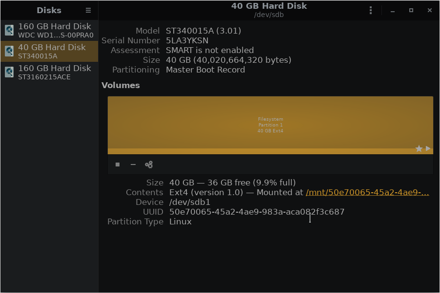
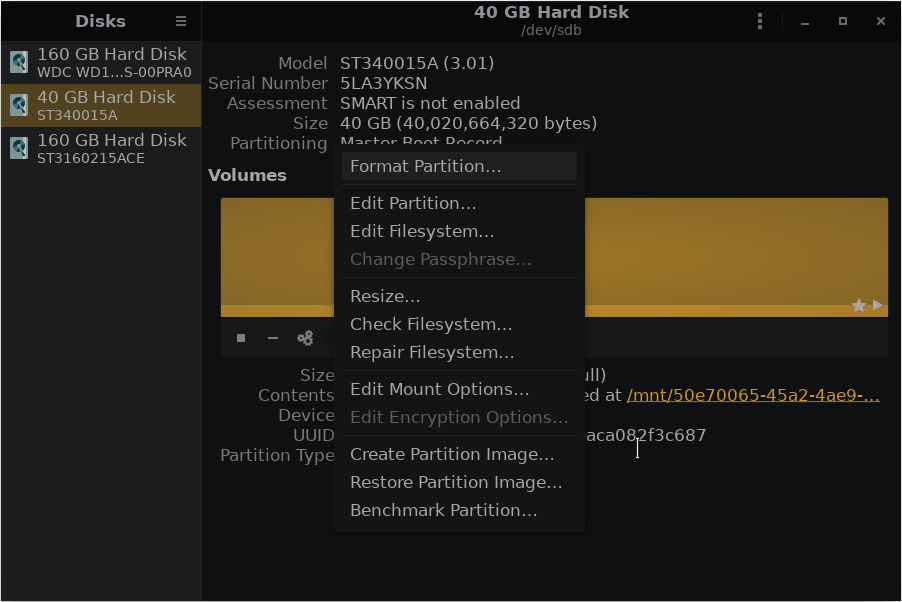
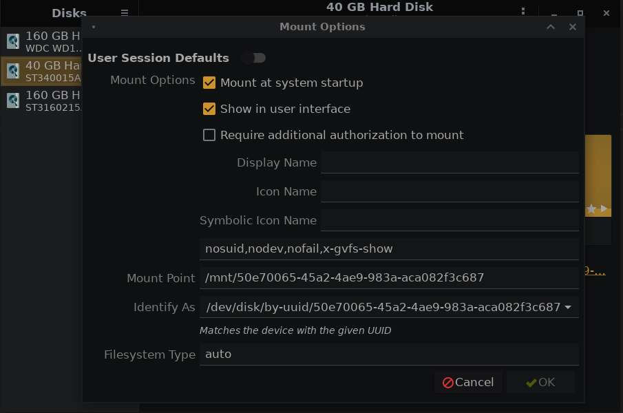

# Automatically Mount Your Drives During Boot Through GUI
## Install Gnome Disk Utility
```console
[wilcy@wilcy-pc ~]$ sudo pacman -S gnome-disk-utility
```
## Steps to Mount Your Drives During Boot
### Click the setting icon in the respective drive you want to mount at boot:



### Then click the edit mount options:



### Now, turn the User Session Defaults off and turn on Mount at system startup:


