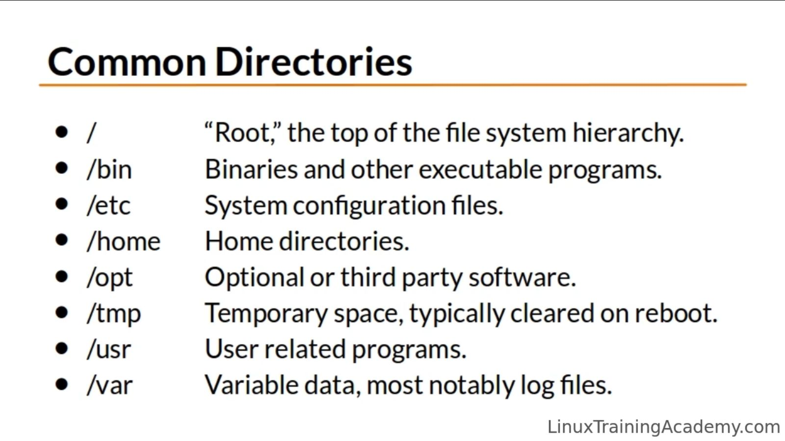

## List of Basic Linux Commands
Open up a Terminal in Linux. You can either use GUI to navigate to the terminal or use shortcut which is Ctrl+Alt+T in most distros to open the Terminal.

### ls - Lists directory contents.
If you run ls without any arguments, it lists the file in the present working directory. You can notice in this example ls output is color coded. All are blue here but there are other colors too.
```console
[wilcy@wilcy-pc ~]$ ls
 Desktop   Documents   Downloads  'Games Backup'   Music   Pictures   Public   Templates   Videos
```
"ls -l" displays the directories and files in a long listing format. We get more information about the files and directories displayed.
```console
[wilce@wilce ~]$ ls -l
total 32
drwxr-xr-x 2 wilce wilce 4096 Mar  7 09:15 Desktop
drwxr-xr-x 2 wilce wilce 4096 Mar  7 02:34 Documents
drwxr-xr-x 7 wilce wilce 4096 Mar  7 06:28 Downloads
drwxr-xr-x 2 wilce wilce 4096 Mar  7 02:34 Music
drwxr-xr-x 2 wilce wilce 4096 Mar  7 02:34 Pictures
drwxr-xr-x 2 wilce wilce 4096 Mar  7 02:34 Public
drwxr-xr-x 2 wilce wilce 4096 Mar  7 02:34 Templates
drwxr-xr-x 2 wilce wilce 4096 Mar  7 02:34 Videos
```

## Accessing the Root User

```console
[wilce@wilce-pc ~]$ su - root
Password: 
[wilce-pc ~]# 
```

- You need the root password to access the root user
- You can access other users in the system similarly
  
## Common Top Level Directories and its Usage in a Linux Operating System



## What is a Shell?

- The shell is a default user interface to a linux system.

- When you login to a linux server like in Putty on Windows over the network the shell is the program that is started and acts as your default interface to the system.

- Also if you are prompted with a text based login prompt during booting the linux system, you will also be interacting with a shell by default.

- If you login to a GUI system. Then you need to start the Terminal Emulator application to gain access to the shell.

- The GUI interface on a linux system is also called a shell. Its a graphical shell.
But when someone refers to shell they are generally refering to the CUI interface.

- It is simply a program that accepts your commands and executes those commands.

- Its also called command line interpreter.

## Command Line Interface Vs a GUI?

- For eg: If you have several files and you need to perform same operation on those files. You can often do this easily on the shell.
So, you have 100 documents to rename then from the shell you can rename 100 documents at once.

- If you are using a graphical user interface you have to click on each file and rename them and do that 100 times.

- Another reason to use CUI is most server distributions of Linux system do not include a GUI.

- Also if you are connecting through ssh to a linux server you need to use a CUI.

- Desktop Distributions have both GUI and CLI which is best of both worlds. Each has its own advantage.

- There are even command line web browsers on linux.