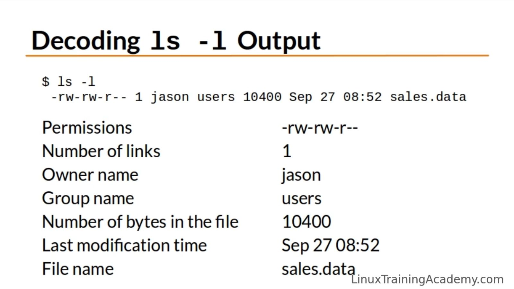

### ls - Lists directory contents.
If you run ls without any arguments, it lists the file in the present working directory. You can notice in this example ls output is color coded. All are blue here but there are other colors too.
```console
[wilcy@wilcy-pc ~]$ ls
 Desktop   Documents   Downloads  'Games Backup'   Music   Pictures   Public   Templates   Videos
```
"ls -l" displays the directories and files in a long listing format. We get more information about the files and directories displayed.
```console
[wilce@wilce ~]$ ls -l
total 32
drwxr-xr-x 2 wilce wilce 4096 Mar  7 09:15 Desktop
drwxr-xr-x 2 wilce wilce 4096 Mar  7 02:34 Documents
drwxr-xr-x 7 wilce wilce 4096 Mar  7 06:28 Downloads
drwxr-xr-x 2 wilce wilce 4096 Mar  7 02:34 Music
drwxr-xr-x 2 wilce wilce 4096 Mar  7 02:34 Pictures
drwxr-xr-x 2 wilce wilce 4096 Mar  7 02:34 Public
drwxr-xr-x 2 wilce wilce 4096 Mar  7 02:34 Templates
drwxr-xr-x 2 wilce wilce 4096 Mar  7 02:34 Videos
```

## Details that ls -l command provides



- The series of characters represents the directory or file permission. 
- Second information is number of links to that file or directory.
- 3rd information is who the owner of that file is.
- 4th information is what group that file belongs to.
- The size of that file in bytes.
- Last time that file or directory was modified. 
- Name of the file or directory itself.