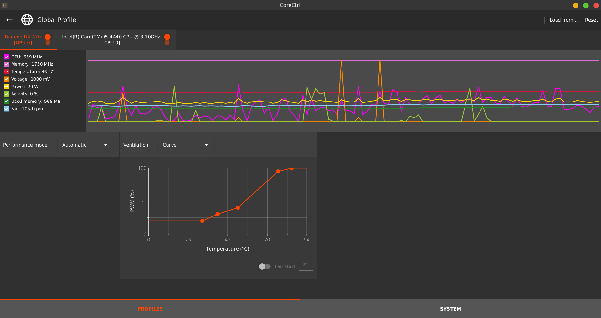

## What is CoreCtrl?

CoreCtrl is a Free and Open Source GNU/Linux application that allows you to control with ease your computer hardware using application profiles. It aims to be flexible, comfortable and accessible to regular users.

[Offical GitLab Link](https://gitlab.com/corectrl/corectrl)

## Installing CoreCtrl

It is easily available on all the major package managers.



Easily changing the fan curves of our GPU as shown above in the picture.

## Auto-Starting CoreCtrl at a Startup

### Execute this command on a terminal 

```bash
[wilson@wilson-pc ~]$ cp /usr/share/applications/org.corectrl.corectrl.desktop ~/.config/autostart/org.corectrl.corectrl.desktop
```

### Don't ask for user password

```bash
[wilson@wilson-pc ~]$ pkaction --version
```
#### For Polkit version >= 0.106

Create the file /etc/polkit-1/rules.d/90-corectrl.rules with the following contents:

```
polkit.addRule(function(action, subject) {
    if ((action.id == "org.corectrl.helper.init" ||
         action.id == "org.corectrl.helperkiller.init") &&
        subject.local == true &&
        subject.active == true &&
        subject.isInGroup("your-user-group")) {
            return polkit.Result.YES;
    }
});
```

Replace your-user-group with your user group name.

### [Refer to this guide for more info](https://gitlab.com/corectrl/corectrl/-/wikis/Setup)

