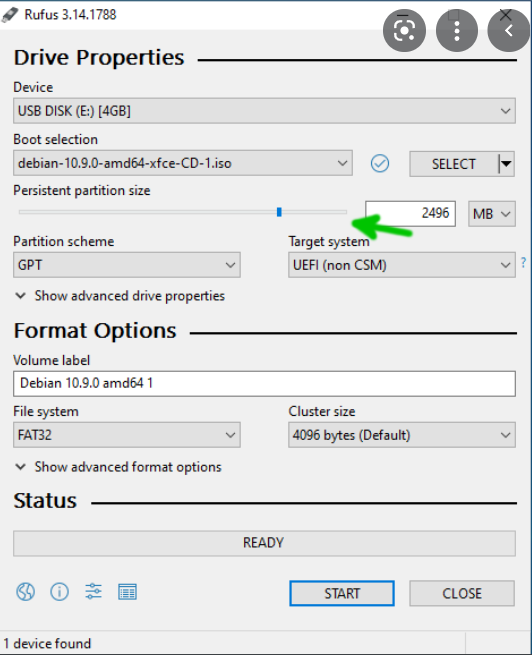

### Note: This guide assumes you have Windows 10 alredy installed and running on your system
### And this guide is only for UEFI Systems
### Keep a USB flash drive ready

## Shrinking the drive

- Disable Secure Boot in bios if it is enabled.

- In windows go to Start->Create and format hard disk partitions.

- Select your desired drive and put the value of the size and click Shrink.

- If you are installing on a completely new drive then you don't have to shrink your current drives.

## Making your USB Pendrive Bootable using any Linux Distro of your choice

- Download [Rufus](https://rufus.ie/en/).

- Connect your pendrive to your PC.

- Point to the Arch Linux Distro ISO by clicking select.

- Make sure you choose GPT on your partition scheme and Target System as UEFI.

- Choose the boot/efi which contains the efi files for windows.
Do not format it. Just choose boot/efi partition. Choose boot flag.

- Choose a root partition with ext4 as file system and root flag.

- Choose swap partition (optional) with linuxswap as file system and swap flag.

