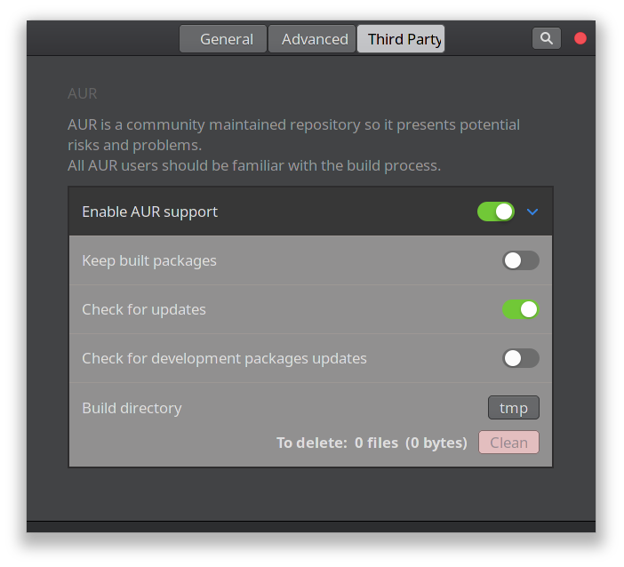

## Enabling AUR and Installing package from AUR

Go to preferences.

Then go to Third Party tab and Enable AUR Support. 

Installing AUR Packages. You can get variety of packages which are not available in the official pacman repository.

