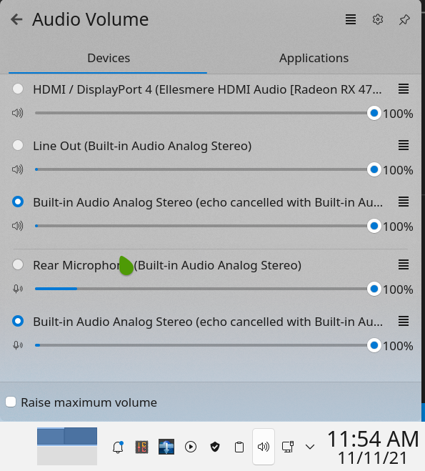

## What is PulseAudio?

- PulseAudio is a network-capable sound server program distributed via the freedesktop.org project. It runs mainly on Linux, various BSD distributions such as FreeBSD and OpenBSD, macOS, as well as Illumos distributions and the Solaris operating system.

## Microphone echo/noise cancellation

- Arch does not load the PulseAudio echo-cancellation module by default, therefore, we have to add it in /etc/pulse/default.pa.d/. First you can test if the module is present with pacmd and entering list-modules. If you cannot find a line showing name: <module-echo-cancel> you have to create:

```
/etc/pulse/default.pa.d/noise-cancellation.pa

### Enable Echo/Noise-Cancellation
load-module module-echo-cancel use_master_format=1 aec_method=webrtc aec_args="analog_gain_control=0\ digital_gain_control=1" source_name=echoCancel_source sink_name=echoCancel_sink
set-default-source echoCancel_source
set-default-sink echoCancel_sink
```

- then restart Pulseaudio:

```
$ pulseaudio -k
$ pulseaudio --start
```
- Now you will see echo cancelled profile on your audio settings

