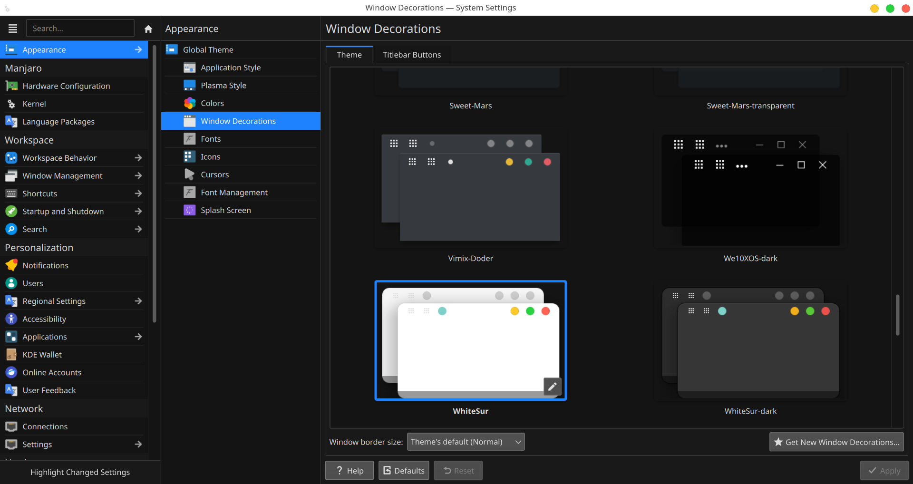

## Changing Appearance one at a time in System Settings

Note: Not Global Theme, if you want to change individual appearance of your system

- Go to Appearance in System Settings.

- Go to Application Style and Click on Configure GNOME/GTK Application Style.

### Note: Its better to match GTK Style with KDE Theme for a consistent experience

- Go to Get New GNOME/GTK Application Styles.

- Pick one and install

## Changing Plasma Style, Colors, Window Decoration, Icons, Cursors, Splash Screen.

- Plasma Style changes the taskbar area of your desktop like shown below.

- Colors changes the whole color scheme of your desktop like light and dark shown below.

- Window Decoration changes the window color like white color shown on top in below screenshot.

- Splash Screen changes the screen on boot time, like Windows screen loading while booting the computer.

## Final Result of themeing your KDE Plasma Desktop

