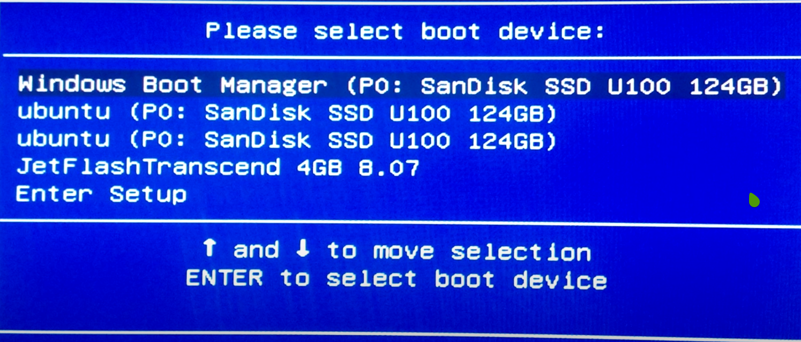
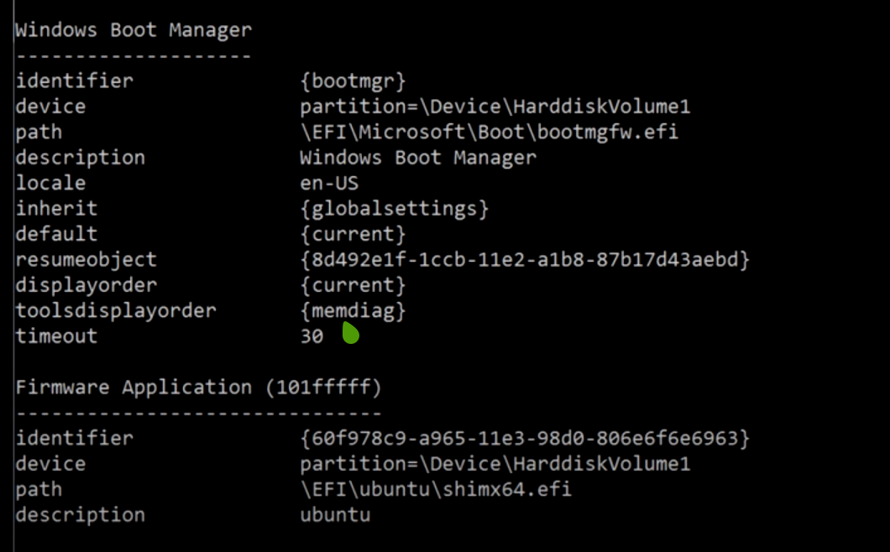
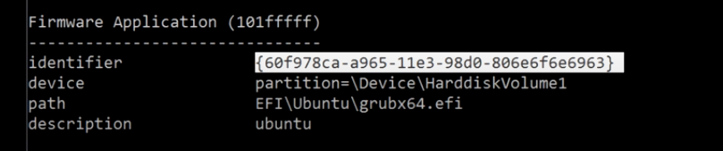

# Warning, follow the steps very carefully, can make your system unbootable
## What is Efibootmgr
- efibootmgr is a tool for managing UEFI boot entries. It is not a bootloader. It is a tool that interacts with the EFI firmware of the system, which itself is acting as a bootloader. Using efibootmgr boot entries can be created, reshuffled and removed.

## Boot Menu and old EFI entries



- Here ubuntu is the old efi system

## Steps to remove old EFI entries from Boot Menu

- Boot to Windows and in console type

```console
C:\> bcedit /enum firmware
```



- This is the result which shows all the efi entries in our system

```console
C:\> bcedit /export newbcd
```

- This command exports the above results into a file.

```console
C:\> copy newbcd backupbcd
```

- Create a backup of the newbcd file in case something goes wrong



- Now, copy the identifier of the efi entry you want to remove

```console
C:\> bcedit /store newbcd /delete {identifier}
C:\> bcedit /import newbcd /clean 
```

- Use the first command to delete the identifier and 
second command to import the newbcd to the efibootmgr.

