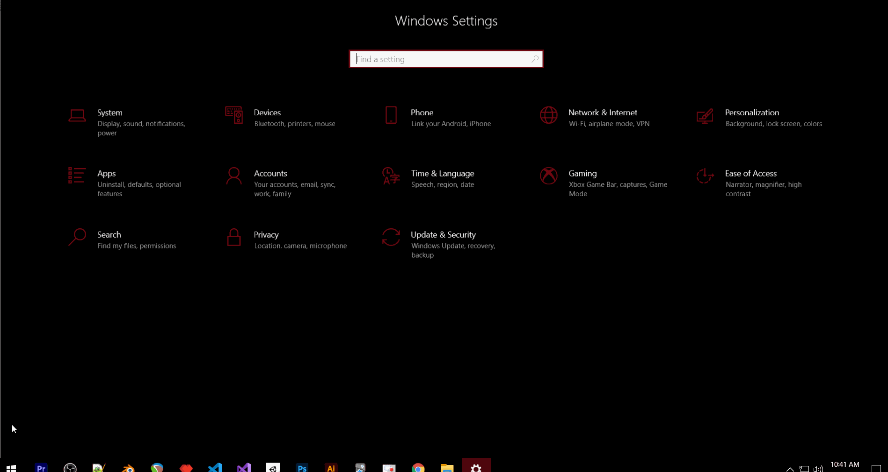

### What is SSH?
SSH or Secure Shell is a cryptographic network protocol for operating network services securely over an unsecured network. Typical 
applications include remote command-line, login, and remote command execution, but any network service can be secured with SSH.
### Installing SSH Server on Linux
[OpenSSH](https://www.openssh.com/) is the tool used for remote login with SSH Protocol. Most Linux Distros have this already installed on their system.
But you can use your favourable package manager to install OpenSSH on your system.
Command to install OpenSSH on Ubuntu:
```bash
sudo apt install openssh-server
```
[Click to see SSH Install Demonstration](sshInstallLinux.jpg)
### Installing SSH Client on Windows 10
To install SSH: click on Start -> Settings Apps -> Apps and Features -> Manage Optional Features. Next locate “OpenSSH Client“, then click “Install“.


