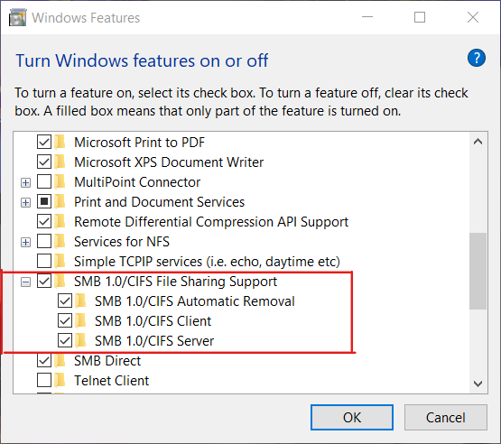
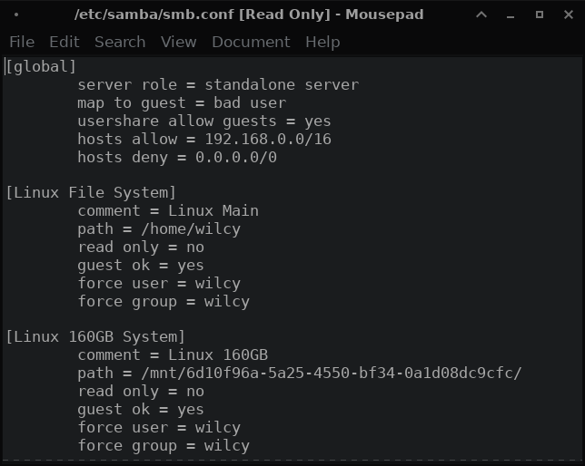

## What is Samba?
[Samba](https://www.samba.org) is the standard Windows interoperability suite of programs for Linux and Unix. Since 1992, Samba has provided secure, stable and fast file and print services for all clients using the SMB/CIFS protocol, such as all versions of DOS and Windows, OS/2, Linux and many others.

## Installing Samba on Linux
You can install Samba on any of your favourite package manager or distro. However, command to install Samba on Ubuntu is below. Type the command on your Linux Terminal:
```bash
sudo apt install samba
```

## Installing Samba on Windows
- Press Windows Key + R to bring up the run dialog and type: optionalfeatures.
- Expand “SMB 1.0/CIFS File Sharing Support” and then check the box next to “SMB 1.0/CIFS Client“
- Click OK.
- The installation will now proceed and you should be able to access shares using the SMB 1 Protocol.<br><br>


## Configuring Samba on Linux
In Linux Terminal go to /etc/samba and create a smb.conf file if there are none.
```console
[wilcy@wilcy-pc ~]$ cd /etc/samba
[wilcy@wilcy-pc samba]$ ls
private  smb.conf
[wilcy@wilcy-pc samba]$
```
If there is already a default smb.conf file as shown above then you should rename the current smb.conf file to smb.conf.old.
This is done to preserve the default configuration file such that if any issue arises with the new one we created.
```console
[wilcy@wilcy-pc samba]$ sudo mv smb.conf smb.conf.old
```
Use a text editor to edit or create the smb.conf file. You can use any text editor like vim,nano,gedit etc.
```console
[wilcy@wilcy-pc samba]$ sudo nano smb.conf
[sudo] password for wilcy:
```
The [global] tab defines configuration for the actual samba share server.
Write the following texts in smb.conf file using a text editor.
```
[global]
        server role = standalone server
        map to guest = bad user
        usershare allow guests = yes
        hosts allow = 192.168.0.0/16
        hosts deny = 0.0.0.0/0
```
### Role of each command written above:
- [global] is always the first tab you define.

- server role = standalone server  (This defines our linux server role as standalone server)

- map to guest = Bad User ( This says if someone does an anonymous login or fails to login correctly, 
what do we do with the user? Do, we put them as guest if they are bad user.) 
If you never want anybody to use your server on a failed login or anonymous login then you would put
map to guest = never

- So, since we mapped bad user as guest. We need to allow the guests using
usershare allow guests = yes

- After this we are going to add a little bit of security to our samba share.
hosts allow =  192.168.0.0/16 (Any ip that starts with 192.168 will be allowed to connect to the samba share server. 
This defines any private ip address that will fall into a residental home address will be allowed)

- hosts deny = 0.0.0.0/0
This denies anything that is not in the range above.
Say a hacker gets in from an external ip he would be denied.

The [sharetab] is used to define configuration for our particular share, say a folder,file or even an entire hard drive.
Write the texts just after finishing the [global] tab configuration.
```
[Linux File System]
        comment = Linux Main
        path = /home/wilcy
        read only = no
        guest ok = yes
        force user = wilcy
        force group = wilcy
```
### Role of each command written above:
- [Linux File System] is our share name

- comment = Linux Main (This is just a info to ourselves on what this particular share is for)

- path = /home/wilcy ( This defines the path to the share which can be path to any folder or even a drive like shown here)

- read only = no ( This makes it possible for windows machine or other client accessing this particular samba share to write and read both)

- guest ok = yes (This means anybody that accesses this particular share will be a guest)

Right now, this linux share is not owned and operated by anybody, so, you being user wilcy in the linux system won't be able to write into this linuxshare or change the files in it. Therefore, we need to change this.

- force user = wilcy (Anything that is created is associated with the username wilcy)

- force group = wilcy (This basically makes it to the local user named wilcy, it makes it so you can easily do this. Anybody that creates anything on this share, will basically be assigned this user wilcy where the user can do anything with the file)

Save the config file and exit.



### Checking configuration file for any errors
Inside /etc/samba we use the command testparm to check if there are any errors in our smb.conf file.
We can see there are no syntax errors in our smb.conf file as shown below.
```console
[wilcy@wilcy-pc ~]$ cd /etc/samba
[wilcy@wilcy-pc samba]$ testparm
Load smb config files from /etc/samba/smb.conf
Loaded services file OK.
Weak crypto is allowed
Server role: ROLE_STANDALONE

Press enter to see a dump of your service definitions
```


