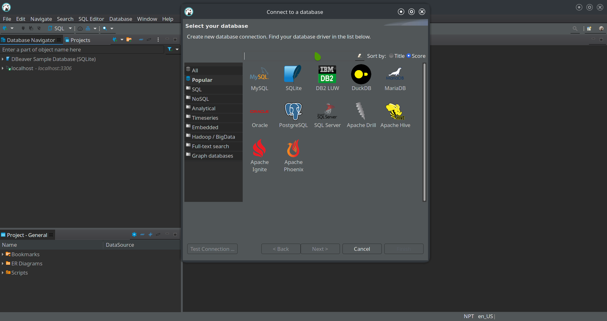
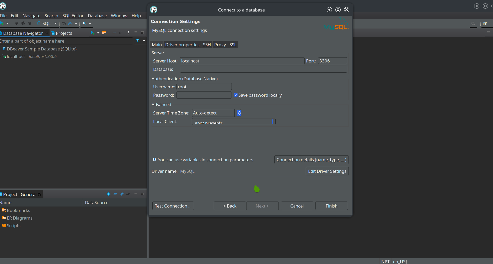
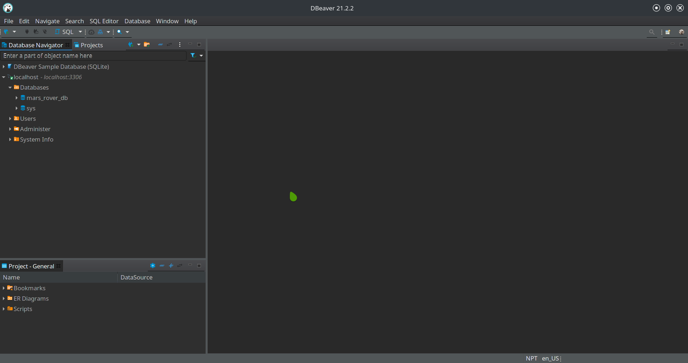

## Installing mariadb
```bash
[wilson@wilson-pc ~]$ sudo pacman -S mariadb
[sudo] password for wilson: 
warning: mariadb-10.6.4-1 is up to date -- reinstalling
resolving dependencies...
looking for conflicting packages...

Packages (1) mariadb-10.6.4-1

Total Installed Size:  235.94 MiB
Net Upgrade Size:        0.00 MiB

:: Proceed with installation? [Y/n] 
```

## Initialize MySQL Data Directory
```bash
[wilson@wilson-pc ~]$ sudo mysql_install_db --user=mysql --basedir=/usr --datadir=/var/lib/mysql
```
[Link to Source](https://dev.mysql.com/doc/refman/5.6/en/mysql-install-db.html)

## Enabling and Starting mariadb.service
```bash
[wilson@wilson-pc ~]$ sudo systemctl enable mariadb.service
[wilson@wilson-pc ~]$ sudo systemctl start mariadb.service
```

## Starting Mysql installation
```bash
[wilson@wilson-pc ~]$ sudo mysql_secure_installation
```

## Changing root user password from native mysql password
```bash
[wilson@wilson-pc ~]$ sudo mysql -u root -p
MariaDB [(none)]:- ALTER USER 'root'@'localhost' IDENTIFIED VIA mysql_native_password USING PASSWORD('root');
```

## Using DBeaver to login to the SQL Server through GUI

### Creating new MySQL connection


### Adding the root user password and testing the connection


### Utilizing the MySQL Server and creating our own database


