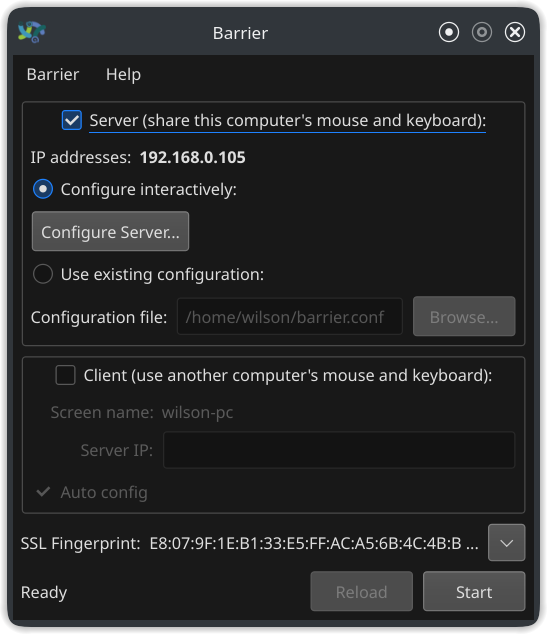
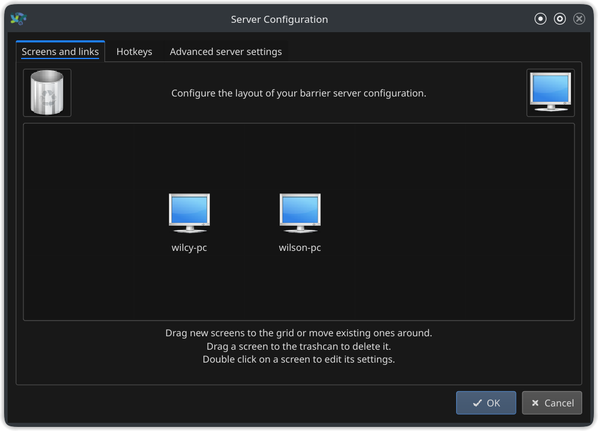

## Control two or more PC's using same Mouse and Keyboard

### Steps

- Install Barrier on both your systems through package manager or directly downloading from the git.

- https://github.com/debauchee/barrier/releases

- Make one a server and another a client in the barrier settings

- Configure your monitor placement where the server is and the client is. Also write name of client correctly here.

