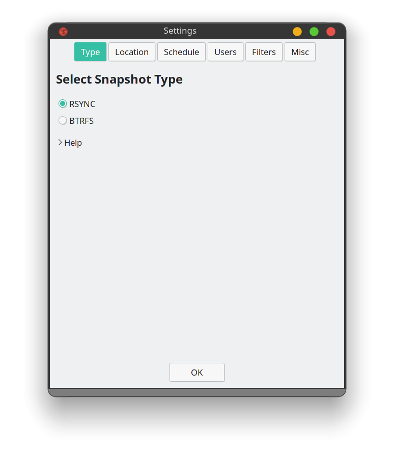
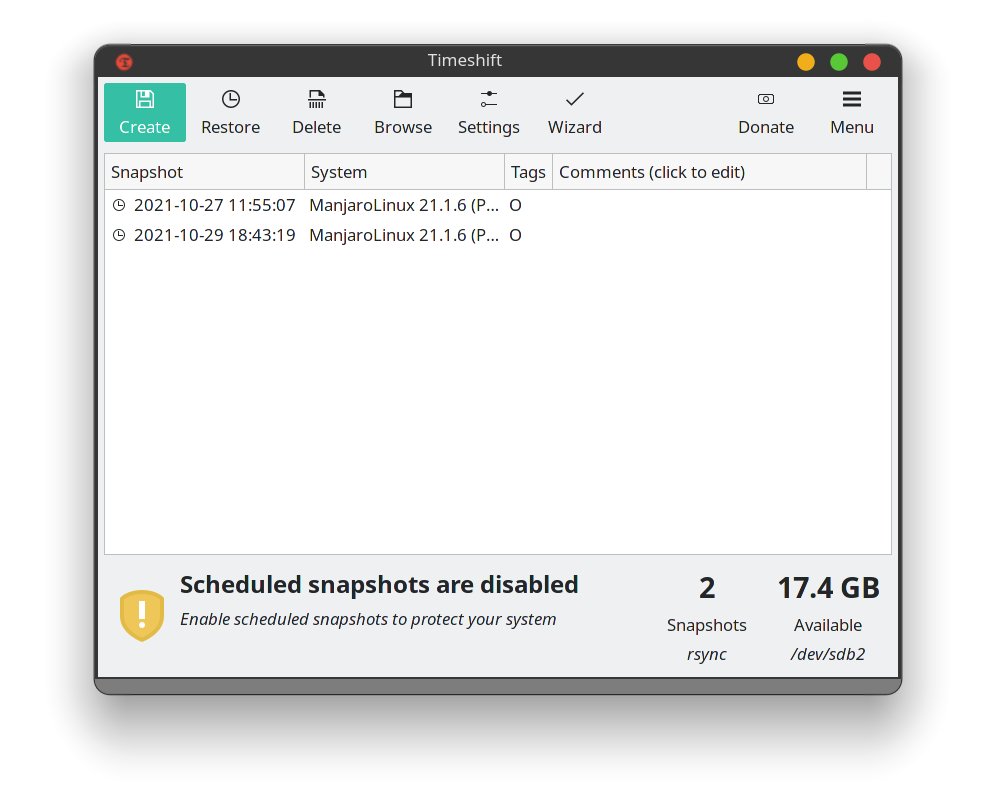

## What is Timeshift?
Timeshift for Linux is an application that provides functionality similar to the System Restore feature in Windows and the Time Machine tool in Mac OS. Timeshift protects your system by taking incremental snapshots of the file system at regular intervals. These snapshots can be restored at a later date to undo all changes to the system.

## Installing Timeshift

```bash
[wilson@wilson-pc ~]$ sudo pacman -S timeshift
[sudo] password for wilson: 
warning: timeshift-21.09.1-2 is up to date -- reinstalling
resolving dependencies...
looking for conflicting packages...

Packages (1) timeshift-21.09.1-2

Total Installed Size:  3.85 MiB
Net Upgrade Size:      0.00 MiB

:: Proceed with installation? [Y/n] 
```

## Using Timeshift

## Note: You need to create a ext4 partition drive if you don't have a ext4 partition. You can format your current drive in ext4 partition easily using programs like Gparted or Gnome Disks.

### Setting up Timeshift


### Creating Snapshots


## Recovering using Timeshift
- If you can't boot to your current system or revert back to previous snapshot for any reason, you need to create a bootable linux media on a pendrive and boot to the live bootable drive. 
- Now, just open Timeshift on that live media and point Timeshift to the drive where you have stored your snapshot. Then
just click restore.
- You should boot into your old snapshot in no time.