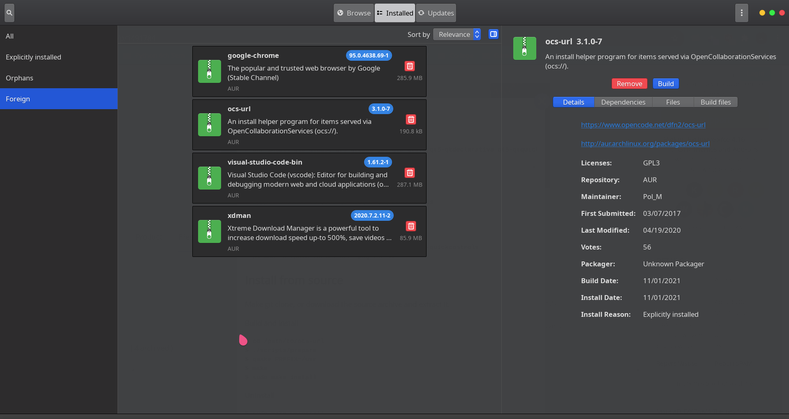
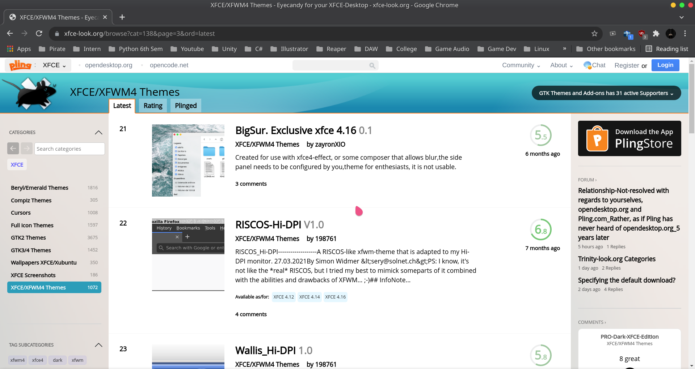
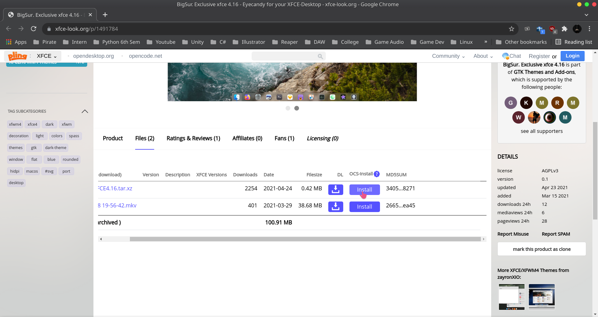
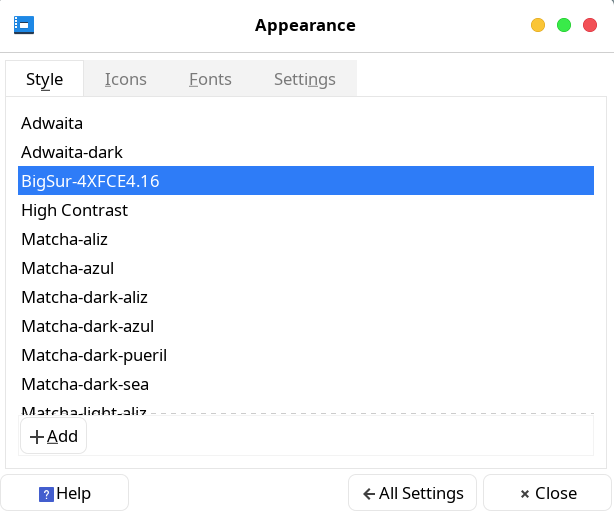
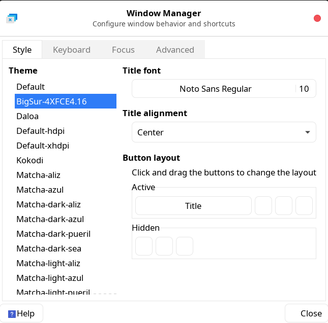
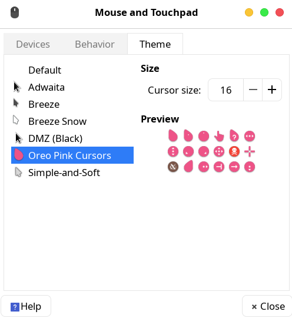

## Installing ocs-url through AUR
- Easiest way to install ocs-url in a arch distro is using pamac or through the GUI Package Manager itself.

## Choosing your theme from Xfce look

https://www.xfce-look.org/

- Just Click install after choosing a theme.

## Applying the theme after Installation

- Go to Settings->Appearance then choose the theme you just installed
- Also go to Window Manager and select the same theme you just installed

- You can similarly change the icons and cursors using the same website.

- Just go to the Settings->Mouse and Touchpad and choose the cursor you installed.

